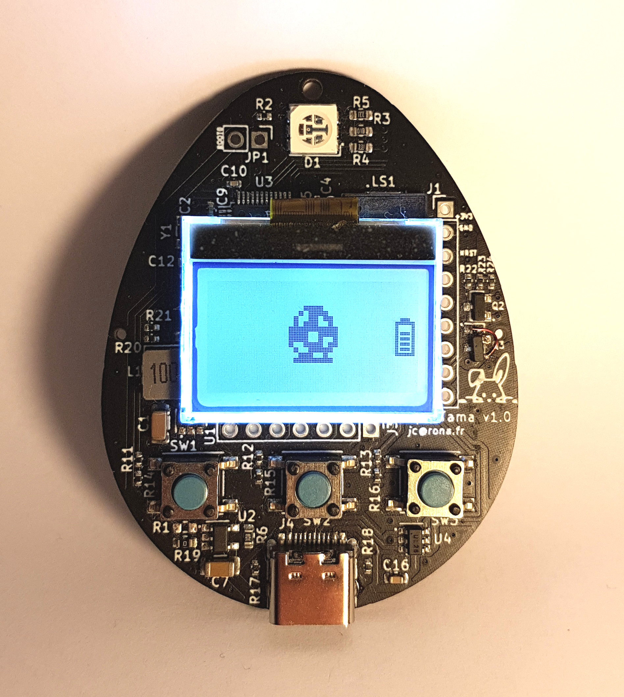
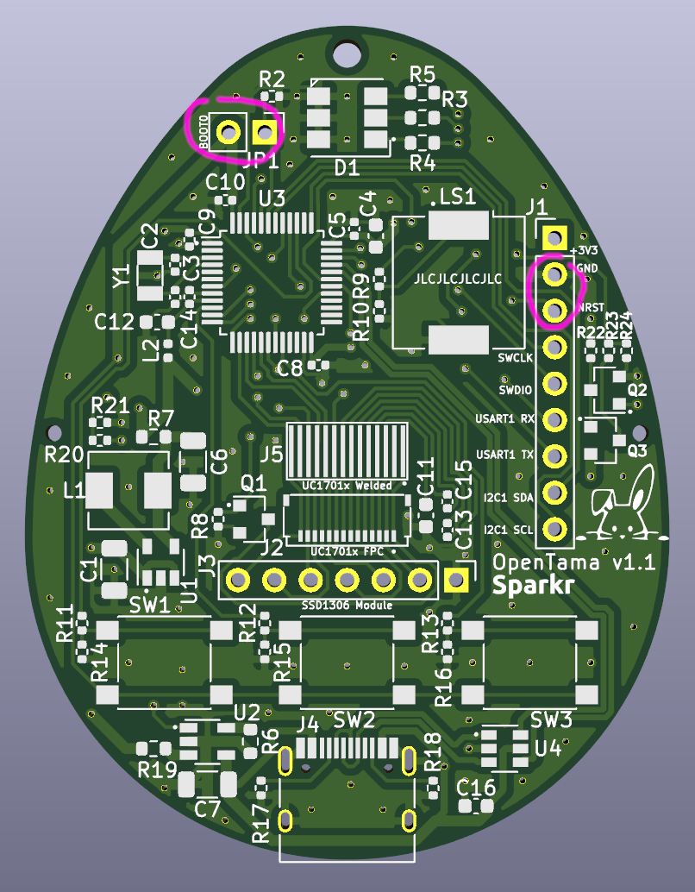

# OpenTama - An open-source reference design for MCUGotchi


## Synopsis

OpenTama is an open-source development board serving educational purposes, specifically designed for [MCUGotchi](https://github.com/jcrona/mcugotchi/) using [KiCad](https://www.kicad.org/).



It features:
* a low-power STM32L072CBT MCU
* either a backlit 128x64 LCD UC1701x or a 128x64 OLED SSD1306 display
* an RGB LED for notifications
* a piezoelectric speaker
* a 1000mAh battery
* a USB C connector for data and charging
* three buttons

Being an open-source hardware design, anyone can manufacture his/her own board. Furthermore, all components have been placed on the top side of the board, so that the assembly as well can be performed by EMS such as JLCPCB, even for small quantities. The battery and screen must be soldered manually.


## Build instructions
### Hardware

1. Make or buy an OpenTama board

	If you decide to build it, please note that the JLCPCB references for all the components have already been provided in the project. However, those have been selected depending on their availability at a specific point in time, and will probably need adjustments if you decide to go with JLCPCB.

2. Decide if you want an SSD1306 OLED screen or a UC1701x LCD screen, and buy it

	The UC1701x LCD is a low power display compared to the SSD1306 OLED that drains way more power. However, if you plan to use the MCUGotchi firmware, the highest power consumption will come from the MCU that will not really have time to sleep, so your choice will not have a big impact on the overall power consumption.

	If you want to use an SSD1306, the board expects a regular 7-pin 0,96" integrated module. However, if you want a UC1701x, you just need the LCD itself, and you can either choose an FPC one (0.5mm pitch, 14 pins), or one that needs to be soldered (0.6mm pitch, 14 pins).  
For reference, we used [this one](https://www.aliexpress.com/item/32828607106.html).

3. Buy a a battery

	The design has been made assuming a 1000mAh 40x30x12mm Li-Po/Li-ion battery.  
For reference, we used [this one](https://www.aliexpress.com/item/4000742443431.html).

4. Plug or solder the display

5. Solder the battery

6. Your OpenTama board is ready !


### Software
1. Build the firmware of your choosing

	For instance, checkout the [MCUGotchi](https://github.com/jcrona/mcugotchi/) repository and follow the instructions to build it for the OpenTama board.

2. Get and build [dfu-util](http://dfu-util.sourceforge.net/)

3. Boot the board in DFU mode

	Close the BOOT0 jumper at the top of the board, and while doing so, trigger a reset by connecting together the NRST and GND pins at the right of the board.



4. Program the board using __dfu-util__
```
$ cd mcugotchi
$ sudo make flash
```
or
```
$ sudo dfu-util -a 0 -s 0x08000000:leave -D <firmware.bin>
```

5. Enjoy !


## License

OpenTama is distributed under the CERN-OHL-S v2 license. See the LICENSE file for more information.

__  
Copyright (C) 2022 Sparkr
